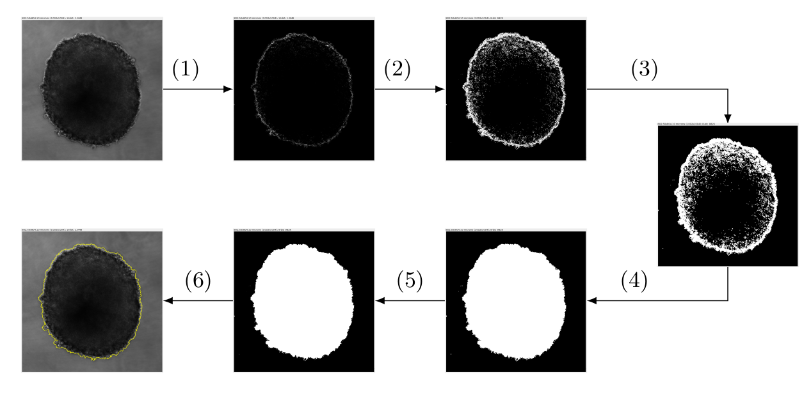

# SpheroidJ

SpheroidJ is an [ImageJ](http://imagej.net/Welcome) plugin for spheroid segmentation. 

## Table of contents

1. [Installation](#installation)
2. [Segmentation method](#segmentation-method)
3. [Deep learning method](#deep-learning-method)
4. [Datasets and results](#datasets-and-results)
5. [Video](#video)
6. [Acknowledgments](#Acknowledgments)

## Installation

### Python package

In order to use the deep learning model included in SpheroidJ, it is necessary to install the following Python package:

```bash
pip install SpheroidJ
```

Once this library is installed, it can be used through the ImageJ plugins or from the command line with the following two commands (the former is employed to segment the spheroid from a single image and the latter for a complete folder):

```bash
spheroides imagePath outputPath
spheroides-folder inputPath outputPath
```

### ImageJ

Download the [latest released jar](https://github.com/joheras/SpheroidJ/releases) into the _plugins_ folder.

### Fiji

You just need to add the SpheroidJ update site:

1. Select _Help > Update..._ from the Fiji menu to start the updater.
2. Click on _Manage update sites_. This brings up a dialog where you can activate additional update sites.
3. Activate the IJPB-plugins update site and close the dialog. Now you should see an additional jar file for download.
4. Click _Apply changes_ and restart Fiji.

### Graphical Interface

A graphical interface built on top of ImageJ to employ SpheroidJ can be downloaded from [here](https://github.com/Wioland/Esferoides-master/).

## Segmentation method

Given an image containing a spheroid, our generic algorithm aims to produce a mask for the region that contains such a spheroid. This process, that is diagrammatically described in the following figure, is based on the sequential application of several image processing techniques, such as edge detection or thresholding, and morphological operations like dilation or erosion. Namely, the procedure can be split into two steps: contour generation and contour refinement.


An example of the application of our generic algorithm is presented in the following image.


(1) Find edges. (2) Thresholding. (3) Dilation. (4) Fill holes. (5) Erosion. (6) Final segmentation (in yellow).

### Particular cases

Due to the different nature of spheroid images, we have particularised our generic algorithm using 5 strategies; that is, using different values for the 5 parameters of our segmentation algorithm. In addition, several variants of our algorithm are combined to deal with those cases where a proper spheroid mask is not generated.

*A1. Threshold.* The first strategy is based on just binarising the spheroid images by using the IsoData method. In those cases where such a direct approach does not produce a valid mask, we sequentially binarise the image, dilate it, fill the holes, erode the image, and, finally, apply the watershed operation. This straightforward approach is useful when the spheroid image can be clearly distinguished from the background of the image.  

*A2. Edges.* The second strategy does not directly binarise the image but it firstly finds the edges of the image, and subsequently binarise the image using the IsoData method. In case that the method does not work, the number of iterations that the find edges operation is applied is increased. The process stops after a valid mask is found or when a number of iterations is reached.  

*A3. Threshold+Edges.* This approach is a sequential application of Algorithms A1 and A2. Namely, it starts applying the threshold approach, and if it fails to find a valid mask, it applies the edges approach. 

*A4. Threshold \& edges.* This strategy applies both Algorithms A1 and A2 to the input image, adds the two resulting masks, and fills the holes of the resulting mask to produce the final output.  

*A5. Fluorescence.* Finally, we have designed an algorithm that takes advantage of images acquired with fluorescence. To this aim, the normal image is processed by sequentially finding its edges and binarising it; and, the fluorescence image is binarised using the IsoData thresholding method. The two images produced in this way are combined using the AND binary operation to output the mask. 

## Deep learning methods

We have also trained several deep learning models with a set of [notebooks]() and [two datasets of spheroid images](). The best model was constructed using the [HRNet-seg architecture](https://arxiv.org/pdf/1908.07919.pdf).

## Datasets and results

### Datasets

Our plugin has been tested with several datasets of images acquired under different experimental conditions. 

| Dataset | Method | #Images  |  Image size | Microscope | Magnification | Format | Type | Culture |
|--------|--------|--------|--------|--------|--------|--------|--------|--------|
| [BL5S](https://github.com/joheras/SpheroidJ/releases/download/Datasets/BL5S.zip) | Brightfield | 50 | 1296x966 | Leica | 5x | TIFF | RGB | Suspension | 
| [BN2S](https://github.com/joheras/SpheroidJ/releases/download/Datasets/BN2S.zip) | Brightfield | 154 | 1002x1004 | Nikon | 2x | ND2 | Gray 16bits | Suspension | 
| [BN10S](https://github.com/joheras/SpheroidJ/releases/download/Datasets/BN10S.zip) | Brightfield | 105 | 1002x1004 | Nikon | 10x | ND2 | Gray 16bits | Suspension | 
| [FL5C](https://github.com/joheras/SpheroidJ/releases/download/Datasets/FL5C.zip) | Fluorescence | 19 | 1296x966  | Leica | 5x | TIFF | RGB | Collagen | 
| [FL5S](https://github.com/joheras/SpheroidJ/releases/download/Datasets/FL5S.zip) | Fluorescence | 50 | 1296X966 | Leica | 5x | TIFF | RGB | Suspension | 
| [FN2S](https://github.com/joheras/SpheroidJ/releases/download/Datasets/FN2S.zip) | Fluorescence | 34 | 1002x1004 | Nikon | 2x | ND2 | Gray 16bits | Suspension  |
| [BO10S](http://imagej.1557.x6.nabble.com/A-macro-for-automated-spheroid-size-analysis-td5009205.html) | Brightfield | 64 | 3136x2152 | Olympus | 10x | JPG | RGB | Suspension |

### Results brightfield datasets

Mean (and standard deviation) for the brightfield datasets. The best result for each dataset is highlighted in bold face, *** <0.001, > significant difference between methods. In and Iv stand for Insidia and Ivanov, respectively.

|| [Insidia](https://doi.org/10.1002/biot.201700140) | [Ivanov](http://dx.doi.org/10.1371/journal.pone.0103817) | A1 | A2 | A3 | A4 | HRNet| Friedman Test | Dunn test | 
|---------| --------- | --------- | --------- | --------- | --------- | --------- | --------- | --------- |--------- |
| BL5S | 0(0) | 0(0) | 0.55(0.33) | 0.31(0.42) |  0.63(0.39) | 0(0) | **0.75(0.25)** |154.756*** | A3>A1>A2,A4,In,Iv | 
| BN2S | 0.65(0.35) | 0.2(0.36) | 0.93(0.04) | 0.94(0.02) | 0.72(0.35) | 0.73(0.35) | **0.96(0.01)** | 427.632***  | A2,A1>A4>A3>In>Iv |
| BN10S | 0.84(0.07) | 0.03(0.18) | 0.65(0.38) | 0.69(0.42) | 0.6(0.42) | 0.95(0.01) | **0.97(0.01)** |  190.462*** | A4>In>A2,A1>A3>Iv |
| BO10S | 0.91(0.09) | 0.94(0.17) |  **0.94(0.03)** | 0.42(0.42) | 0.79(0.36) | 0.88(0.10) | 0.92(0.03) | 224.473*** | A1,Iv>In,A4,A3>A2 | 
| Combined | 0.64(0.37) | 0.28(0.43) |  0.81(0.27) | 0.68(0.41) | 0.7(0.39) | 0.74(0.35)| **0.92(0.12)**  | 385.751*** | A1>A4,A3,A2>In,Iv |

### Results fluorescence datasets

Mean (and standard deviation) for the fluorescence datasets. The best result for each dataset is highlighted in bold face, *** <0.001, > significant difference between methods. In and Iv stand for Insidia and Ivanov, respectively.

|| [Insidia](https://doi.org/10.1002/biot.201700140) | [Ivanov](http://dx.doi.org/10.1371/journal.pone.0103817) | A1 | A2 | A3 | A4 | A5 | HRNet| Friedman Test | Dunn test | 
|---------| --------- | --------- | --------- | --------- | --------- | --------- | --------- | --------- |--------- |--------- |
| FL5C  |  0.12(0.24)  |  0.09(0.28)  |  0.53(0.37)  |  0(0)  |  0.4(0.37)  |  0(0)  |  0.67(0.17) | **0.71(0.3)**  74.530***  | A5,A1,A3>In,Iv,A2,A4|
| FL5S  |  0.51(0.24)  |  0.04(0.1)  |  0.31(0.21)  |  0.04(0.14)  |  0.42(0.27)  |  0(0)  |  **0.89(0.07)** | 0.70(0.26)| 191.062***  |  A5>In,A3,A1>A2,Iv,A4|
| FN2S  |  0.03(0.02)  |  0(0)  |  0.65(0.3)  |  0.47(0.36)  |  0.02(0.16)  |  0.05(0.04)  |  **0.82(0.17)** | 0.78(0.2)| 148.081*** |  A5>A1,A2>A4,In,A3,Iv|
| Combined  |  0.25(0.29)  |  0.03(0.15)  |  0.48(0.32)  |  0.19(0.32)  |  0.27(0.32)  |  0.03(0.10)  |  **0.82(0.16)** | 0.74(0.25)| 2.78.983***  | A5>A1,In,A3>A2,A4,Iv |

## Video

## Acknowledgments 

This work was partially supported by Ministerio de Economía y Competitividad (MTM2017-88804-P), and Agencia de Desarrollo Económico de La Rioja (2017-I-IDD-00018).
